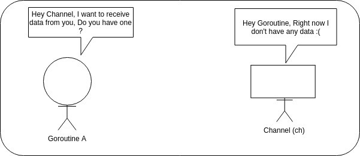
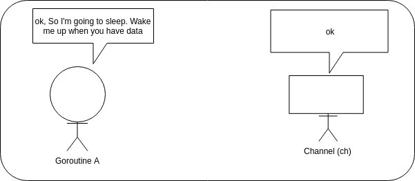

深入理解*Golang*的*Channel*
===================

*Golang*中的并发远不止是语法：

> 这是一种设计模式

一种设计模式，它是处理并发是常见问题的可重复解决方案，因为

> 并发需要同步

*Go*使用一个名为*CSP(Communicating Sequential process)*的并发模型，通过*Channel*实现这种同步模式。它的核心核心哲学是：

> 不要通过共享内存来通信；相反，通过通信来共享内存

但*Go*也相信你做正确的事情，所以本文的其余部分将尝试打开*Go*哲学的大门以及展示*Channel*的——使用一个队列实现*channel*的效果。


### *Channel*
----------

```golang
func goRoutineA(a <-chan int) {
    val := <-a
    fmt.Println("goRoutineA received the data", val)
}
func main() {
    ch := make(chan int)
    go goRoutineA(ch)
    time.Sleep(time.Second * 1)
}
```





在接收或者发送数据时，*Go*中的*Channel*的责任是使*Goroutine*在*Channel*上阻塞。

如果不熟悉*Go Scheduler*，请阅读有关它的介绍:[https://morsmachine.dk/go-scheduler](https://morsmachine.dk/go-scheduler)

### *Channel*的结构
---------

在*Go*中，*Channel*的数据结构是*Goroutine*之间消息传递的基础，所以，我们看一下在创建*channel*结构体时发生了什么：

```golang
ch := make（chan int，3）
```


